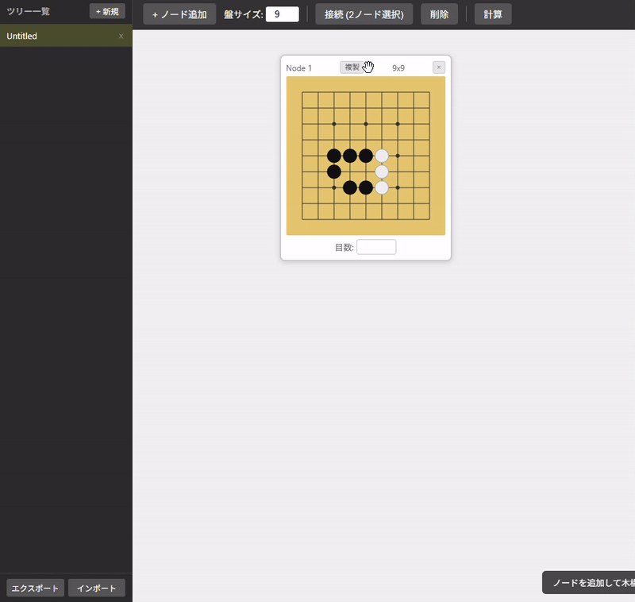

# GoYose - 囲碁ヨセ研究ツール

囲碁の終盤（ヨセ）における着手の価値を、木構造を使って逆算で計算する Web アプリケーションです。

## 概要

ユーザが任意の木構造を構築し、葉ノードに目数を入力すると、子ノードの平均値を親へ伝播させて全ノードの目数を算出します。各ノードには碁盤が付属しており、局面を視覚的に記録しながら分析できます。

## 使い方

https://sougyo.github.io/GoYose/ にアクセスしてください。



### ツリー管理

- **新規作成** - 左サイドバーの「+ 新規」ボタンでタイトルを指定して新しいツリーを作成
- **切り替え** - サイドバーのタイトルをクリックでツリーを切り替え
- **タイトル編集** - サイドバーのタイトルをダブルクリックでインライン編集
- **並び替え** - サイドバーの項目をドラッグ&ドロップで順序を変更
- **削除** - サイドバーの各項目の × ボタンでツリーを削除
- **折りたたみ** - サイドバー左上の ◀ / ▶ ボタンでサイドバーを折りたたみ / 展開（スマホでは起動時に自動で折りたたまれます）

### ノード操作

1. **盤面追加** - ツールバーの「+ 盤面追加」ボタンで新しいノードを作成（盤サイズは 3〜19 で指定可能）
2. **碁盤に石を配置** - ノード内の碁盤をクリック（またはタップ）で黒 → 白 → 空を切り替え
3. **ノードを複製** - ノードの「複製」ボタンで盤面をコピーした子ノードを自動作成・接続
4. **手動接続** - Ctrl+クリックで 2 つのノードを選択し「接続」ボタンで親子関係を設定（先に選択したノードが親）
5. **目数を入力** - 葉ノード（子を持たないノード）の目数欄に数値を入力
6. **計算** - 「計算」ボタンで葉から根へ平均値を伝播し、接続線上に一手の価値（親子間の目数差の絶対値）を表示
7. **削除** - ノードの × ボタン、または選択中に Delete キーで削除

### キャンバス操作

- **ノードのドラッグ** - ノードのヘッダー部分をドラッグして移動
- **背景パン** - 背景の空き領域をドラッグして全体をスクロール
- **ズーム** - マウスホイールでカーソル位置を中心にズームイン / ズームアウト
- **タッチ操作** - 1 本指でパン、2 本指でピンチズーム

### 保存 / 読込

- **保存** - ツールバーの「保存」ボタンで全ツリーを JSON ファイルとしてダウンロード
- **読込** - 「読込」ボタンで保存した JSON ファイルを読み込み、全ツリーを復元
- **ファイルのドロップ** - JSON ファイルをウィンドウにドラッグ&ドロップして読み込むことも可能
- **自動保存** - 「自動保存」ボタンで保存先ファイルを指定すると 3 秒ごとに自動保存（Chrome / Edge のみ対応）

## サーバー版（ローカル実行 + SQLite 保存）

ブラウザの File System Access API に依存しない、SQLite にデータを永続化するローカルサーバー版です。

### 必要環境

- Python 3.6 以上（標準ライブラリのみ使用、追加パッケージ不要）

### 起動方法

```bash
python3 server.py         # http://localhost:5000/ で起動
python3 server.py 8080    # ポートを指定する場合
```

起動後、ブラウザで `http://localhost:5000/` を開いてください。

データは同ディレクトリの `goyose.db`（SQLite）に自動保存されます。

### サーバー版の動作

- **自動保存** - 3 秒ごとにサーバーへ保存、「自動保存」ボタンクリックで即時保存
- **起動時復元** - 前回の状態を DB から自動読み込み
- **保存 / 読込ボタン** - JSON ファイルによるバックアップ・移行は引き続き利用可能
- **全ブラウザ対応** - Chrome / Edge 以外でも自動保存が動作

## 計算ロジック

- 葉ノード: ユーザが入力した目数をそのまま使用
- 非葉ノード: 全子ノードの目数の平均値
- 一手の価値: 親ノードと子ノードの目数の差の絶対値（接続線上に表示）

## 技術構成

- HTML / CSS / JavaScript（バニラ）
- フレームワーク不使用、単一 HTML ファイルで完結
- 碁盤描画: HTML5 Canvas

## ライセンス

[MIT License](LICENSE)
